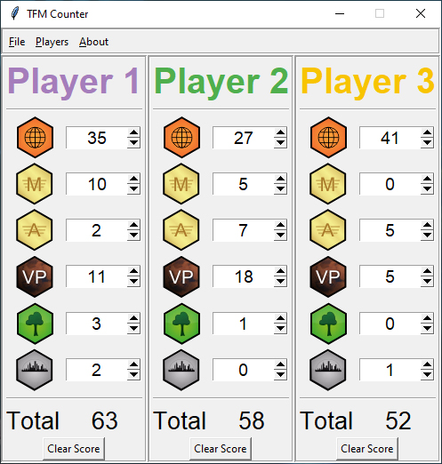

# tfm-counter
Score tracker for Terraforming Mars (physical/digital board game) written in Python.
The GUI uses the built-in Tkinter framework.

## Controls
- You can navigate left/right by using the `left & right arrows`.
- A player's name and color can be changed by clicking on it ('Player 1-5' by default).
- You can use `Tab` to move to the next 'cell' (downwards) and `Shift-Tab` to move to the previous 'cell' (upwards).
- The score for each player is recalculated every time a value is changed by using the `up & down arrows`. It can also be recalculated by hitting `Enter` or `Space`.

## Hotkeys
|Hotkey|Action|
|------|------|
|Ctrl+A|Add new player|
|Ctrl+R|Remove the last player|
|Ctrl+Q|Clear the scoreboard|
